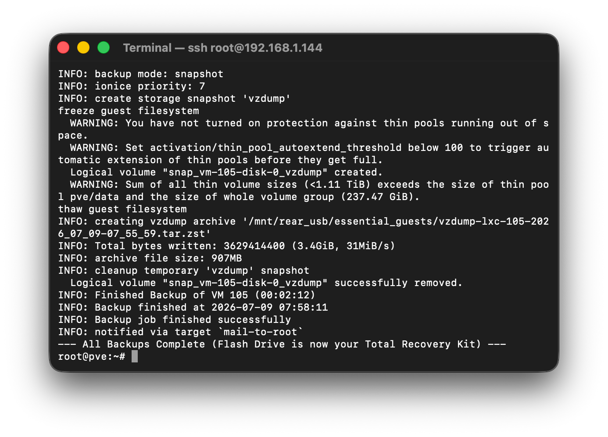

# Proxmox All-in-One USB Recovery Kit

Recover your entire Proxmox VE host and critical workloads from a single bootable USB. Run one command to create a bare-metal backup; if your hardware fails, simply boot from the USB to restore your host and spin your VMs right back up.



## How it Works
This kit creates a single, self-contained Total Recovery Kit on a flash drive by splitting the backup into two components:
1. **Host OS (via ReaR)**: Clones your active Proxmox OS, configurations, network settings, and partition layouts into a bootable Relax-and-Recover environment.
2. **Essential Guests (via vzdump)**: Backs up critical VMs/LXCs (like your Proxmox Backup Server instance) directly to the same USB partition.

> [!NOTE]
> To keep the recovery image lightweight and fast, bulky VM/LXC disks, ISOs, and templates are excluded. Once this kit bootstraps your core infrastructure back online, you can restore the rest of your fleet from your primary external storage or PBS.

## Requirements
* **Proxmox VE 8.x or 9.x** (Debian 12/13).
* **A 32GB+ Flash Drive** (64GB recommended).
* **Root access** to the Proxmox shell.

## Getting Started

### 1. One-Command Setup
Run the setup script on your Proxmox node. This installs dependencies (like `rear`), guides you through an interactive drive selection, and provisions a global custom command (`pve-strong-backup`):

```bash
wget -q -O proxmox-backup-setup.sh https://raw.githubusercontent.com/saihgupr/ProxmoxBackup/main/proxmox-backup-setup.sh && sudo bash proxmox-backup-setup.sh
```

### 2. Run the Backup (Update USB Data)
To update or refresh the backup data on your USB drive at any time, plug the USB in and run:

```bash
sudo pve-strong-backup
```

> [!TIP]
> **Recommended Frequency**: Run this command once a week or before making major changes to your Proxmox configuration.

## How to Recover (Disaster Recovery)

### Phase 1: Restore the Proxmox Host
1. **Boot**: Plug the USB drive into your hardware and select it as the boot device in your BIOS/UEFI menu.
2. **Menu**: Select **"Relax-and-Recover"** from the boot menu.
3. **Login**: Log in as `root` (no password required in rescue mode).
4. **Recover**: Run the recovery wizard:
   ```bash
   rear recover
   ```
   *(Note: This recreates your LVM partitions and thin pools. They will initially be empty, which is expected.)*
5. **Reboot**: Once finished, type `reboot` and remove the USB drive. Your host OS is back online.

### Phase 2: Restore Essential Guests (e.g., PBS LXC)
Once the host is back up, use the USB to restore your core orchestration utilities:
1. Plug the USB stick back into the running Proxmox host.
2. Open the Proxmox Shell and mount the drive:
   ```bash
   mkdir -p /mnt/rear_usb
   mount /dev/disk/by-label/REAR-000 /mnt/rear_usb
   ```
3. In the PVE Web UI, navigate to **Datacenter -> Storage -> Add -> Directory** and enter:
   * **ID**: `Recovery-USB`
   * **Directory**: `/mnt/rear_usb/essential_guests`
   * **Content**: `VZDump Backup file`
4. Select the new `Recovery-USB` storage, choose your essential guest backup (such as your PBS instance), and click **Restore**.
5. **Finalize**: With your core management tools back online, reconnect your primary external storage arrays and restore the remaining cluster fleet.

> **Storage Persistence Note**: ReaR backs up your `/etc/pve/storage.cfg`. Your external drive definitions and mount points are already configured; you just need to physically reconnect the hardware.

## Verification & Testing

### Dry Run
To test the environment and dependencies without writing backup data to a drive, download and execute the script with the dry-run flag:
```bash
wget -q -O proxmox-backup-setup.sh https://raw.githubusercontent.com/saihgupr/ProxmoxBackup/main/proxmox-backup-setup.sh && sudo bash proxmox-backup-setup.sh --dry-run
```

### Manual Verification
Before an emergency happens, verify your files are intact by mounting the drive on any linux system:
```bash
mount /dev/disk/by-label/REAR-000 /mnt/rear_usb
ls -la /mnt/rear_usb/essential_guests/
```
You should see valid `.vma.zst` or `.tar.zst` backup archives corresponding to your selected essential guests.

## Support & Contributions
* **Issues & PRs**: Found a bug or have a suggestion? Open an [issue](https://github.com/saihgupr/ProxmoxBackup/issues) or submit a [pull request](https://github.com/saihgupr/ProxmoxBackup/pulls).
* **Donate**: If this project saved your setup, consider supporting my work on [Ko-fi](https://ko-fi.com/saihgupr).
